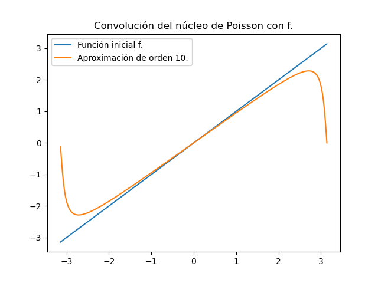
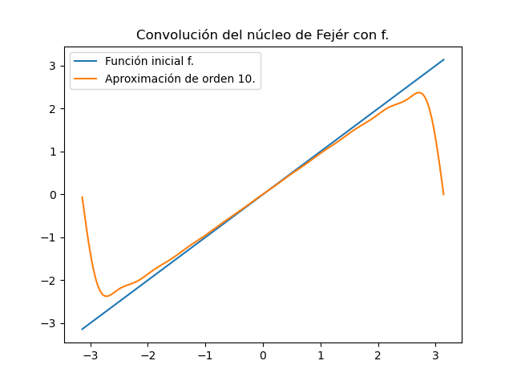

# Código de graficación de mi tesis.

La parte central del código es `nucleos.py`. Ahí he definido una clase de núcleos con dos métodos. Uno calcula la convolución con una función (representada por medio de un arreglo) y toma valores de dominios para resultar en mayor flexibilidad y para verificar los cálculos sobre las transformaciones afines aplicadas a cada núcleo. El único que no se encuentra transformado de esta manera es el núcleo del calor. El otro método simplemente provee una manera sencilla de visualizar ràpidamente cada núcleo. Estos métodos nos permiten definir funciones sin necesidad de instanciar un núcleo específico. Por ejemplo, la función `showcase_kernel()` tiene como salida default:


Otros núcleos se pueden visualizar de casi la misma forma.

* `showcase_kernel(ker_name='fejer')`


* `showcase_kernel(ker_name='poisson')`


* `showcase_kernel(ker_name='heat')`


La estructura de esta función es `showcase_kernel(a=-np.pi, b=np.pi, start=1, end=10, skip=1, ker_name = 'dirichlet')`. Los valores de a y b definen un intervalo [a, b]. Los valores inicial y final de n se pueden asignar con `start` y `end`, respectivamente. Para evitar que se amontonen las gráficas, el valor de `skip` se salta puntos intermedios (e.g. `start=1`, `end=10` y `skip=2`nos devuelve la lista [1, 3, 5, 7, 9, 11], el último valor se añade para no perder información gráfica con valores grandes de `skip`.

La clase de los núcleos nos permite simplificar la convolución con un arreglo arbitrario. Instanciamos un núcleo haciendo
*`K = kernel('dirichlet', -np.pi, np.pi, 10)`
Esto representa un núcleo de Dirichlet en el intervalo $[-\pi, \pi]$ y con $ n =10 $. La precisión estándar del núcleo es de mil puntos desde a hasta b y se puede cambiar modificando el valor de points. Cambiar el valor de `points` después de instanciar la clase no resulta en el cambio de los valores propiamente; para hacer un cambio así hay que sobreescribir el núcleo. La convolución circular del núcleo de Dirichlet con un arreglo nos da el polinomio trigonométrico estándar. El único núcleo que no se calcula de forma circular es el del calor. Veamos unos ejemplos:

```
import numpy as np
t = np.linspace(-np.pi, np.pi, 1000)
K = kernel('dirichlet', -np.pi, np.pi, 10)
K.convolve(t, show=True)
```

Para cada núcleo, tendremos

*Núcleo de Dirichlet.



*Núcleo de Fejér.



*Núcleo de Poisson.


*Núcleo del calor.


